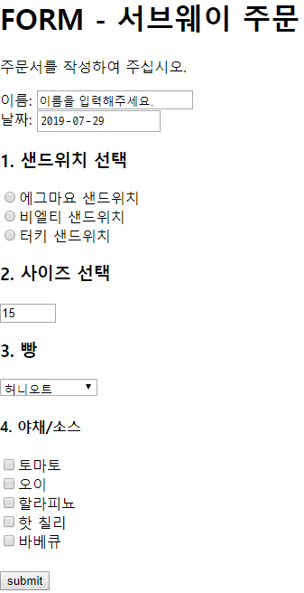

# Web 190729 HTML

Hyper Text Markup Language : 웹페이지를 작성하기 위한 역할표시 언어!

Markup - 구조화!


Cascading Style Sheet : [HTML](https://namu.wiki/w/HTML) 등의 [마크업 언어](https://namu.wiki/w/마크업 언어)로 작성된 문서가 실제로 웹사이트에 표현되는 방법을 정해주는 언어.


self-closing element

일반적인 element들 처럼 `<h1></h1>` 처럼 적을 필요없이 `` 이렇게 사용할 수 있다

`<a herf ="google.com">`  태그에는 속성값 지정가능!


속성

속성명="속성값"에서 띄어쓰기 X

속성값은 ""(Double quote) 안에 사용하기!


시맨틱태그

코드의 가독성을 높이려고!


--

`<h1></h1>` : 중요도를 알려주는 h 태그

`<p></p>` : 본문을 적는 p 태그

`<b></b>` : 굵은 글씨 bold 로 만들어주는 b태그  -> 시맨틱 태그 X

`<strong></strong>` : 굵은 글씨 strong태그 -> 시맨틱 태그 O

```html
<ol>
    <li></li>
    <li></li>
    <li></li>
</ol>
```

순서가 있는 ol태그 그안에 li태그가 여러개!

ol>li*3  tab으로 한번에 적기!

`<div></div>` div : 의미가 

`<span></span>` span : 없당


`<a href=""></a>` a tag : link 연결 hyper refrerence 글자뿐아니라 이미지도 가능

``img tag : 이미지 연결

`<iframe src="" frameborder="0"></iframe>` iframe : 미디어태그


Subway 주문!

```html
<!DOCTYPE html>
<html lang="en">
<head>
    <meta charset="UTF-8">
    <meta name="viewport" content="width=device-width, initial-scale=1.0">
    <meta http-equiv="X-UA-Compatible" content="ie=edge">
    <title>Document</title>
</head>
<body>
```

이 위는 기본값

```html	
<h1>FORM - 서브웨이 주문</h1>
    <p>주문서를 작성하여 주십시오.</p>
    <form action="">
        <label for="name">이름:</label>
        <input id="name" type="text" name="name" value="이름을 입력해주세요." onfocus="this.value=''">
        
```

form안에 하나의 양식을 작성한다!

input으로 text를 받는다! value 값으로 뭘 적어야할지 알려주고 입력하려고 누르면 사라지도록 한다.

`onfocus=" this.value='' "`를 통해서 누르면 사라지는 이벤트를 생성!

```html
<br>
        <label for="when">날짜:</label>
        <input id="when" type="date" name="when">

        <h3>1. 샌드위치 선택</h3>

        <input id="option1" type="radio" name="main" value="1">
        <label for="option1">에그마요 샌드위치</label><br>
        <input id="option2" type="radio" name="main" value="2">
        <label for="option2">비엘티 샌드위치</label><br>
        <input id="option3" type="radio" name="main" value="3">
        <label for="option3">터키 샌드위치</label><br>
```

날짜 데이터를 입력받고 radio의 name을 하나로 묶어서 선택옵션을 만든다.

id와 value를 사용해서 주소창에서 무엇을 선택했는지 알 수 있게한다.

```html
        <h3>2. 사이즈 선택</h3>
        <input type="number" value=15 min="15" max="30" step="15">
```

number 타입으로 받고 초기값 15 	최소:15 최대:30 간격:15로 설정해서  15,20 두가지만 선택하게 한다.

```html
        <h3>3. 빵</h3>
        <select>
                <option value='honey'>허니오트</option>
                <option value='flat' disabled>플렛브레드</option>
                <option value='harty'>하티 이탈리안</option>
        </select>
```

빵을 고르는 드랍박스 형태의 선택기로 고른다! 	`disalbed`로 플렛브레드는 품절임을 표시!

```html
        <h4>4. 야채/소스</h4>
        <input id=opt1 type="checkbox"><label for="opt1">토마토</label><br>
        <input id=opt2 type="checkbox"><label for="opt2">오이</label><br>
        <input id=opt3 type="checkbox"><label for="opt3">할라피뇨</label><br>
        <input id=opt4 type="checkbox"><label for="opt4">핫 칠리</label><br>
        <input id=opt5 type="checkbox"><label for="opt5">바베큐</label><br>
```

checkbox 타입을 사용해서 원하는 야채를 고를 수 있도록 한다.

```html
        <br>
        <input type="submit" value="submit">
        
    </form>
    <script>
    document.getElementById('when').valueAsDate = new Date();
    </script>

</body>
</html>
```

현재 날짜를 표시하기 위해서 `script`를 이용해서 현재 html문서에  `when`으로 id를 지정해둔 input의 값을 

new Date() 함수로 현재 날짜로 만들어준다.

