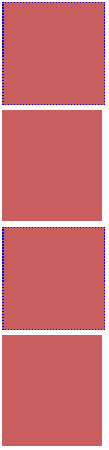
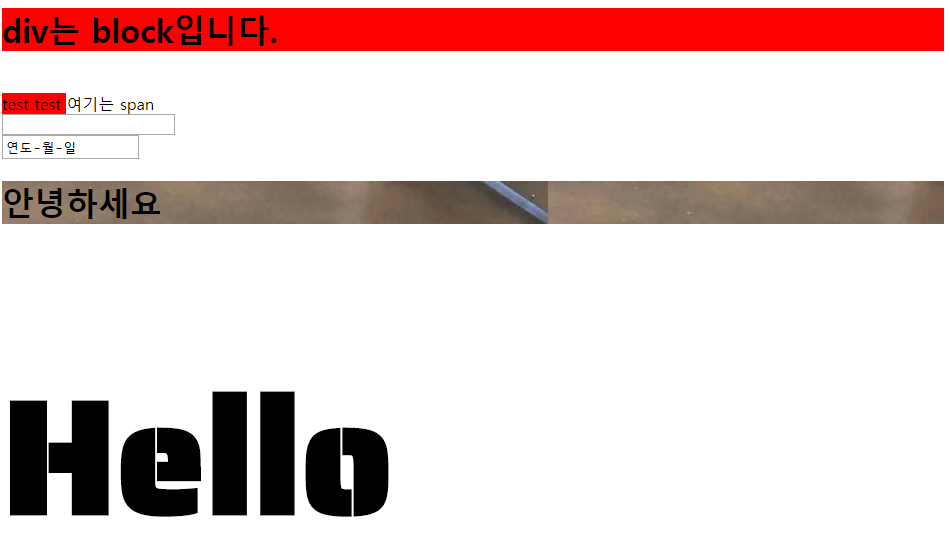
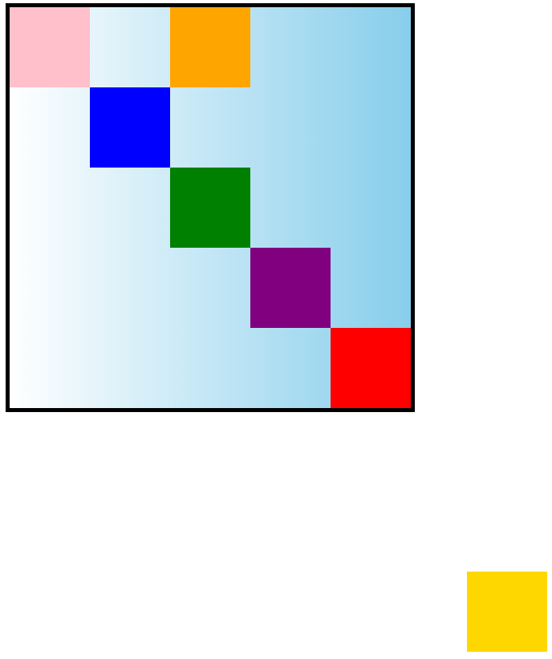

# Web 190730 CSS

직접입력과 style 입력보다는 CSS파일을 따로만들어서 활용하는 것이 좋다.

```html
<link rel="stylesheet" href="00_intro.css">
```


태그에 스타일을 주려면

```css
p{
    font-size: 50px;
}
```

id에 스타일을 주려면

```html
#hello{
	font-size: 50px;
}
```


css의 상속

```css
/* div는 부모 */
div{
    width: 50%
}
/* h1은 자식, 부모의 width를 상속받아서 결국은 50퍼 * 50퍼  */
h1{
    width: 50%
}
```



#### margin

` margin: 10px 20px 30px 40px;`

다른 요소와 요소 사이에 간격을 조정할 때 사용하는 요소


#### padding

`padding-top: 10px;`

원본의 배경을 넓게 해주는 효과를 줄 때 사용하는 요소

원본의 크기에는 영향이 가지 않는다.


#### border

`border: 3px blue dotted;`

경계선 테두리에 적용되는 것들을 활용할 수 있다.




#### font-size

% : 퍼센티지

em : 초기크기의 배수	-> 상위 요소 기준

px : 픽셀

rem :  상대적 크기	-> 최상위 요소 기준

viewport : 단위화면을 기준으로 함 -> vh, vw : viewport height, viewport width


#### box model

모든 항목들이 박스형태로 이루어져있음!


#### inline

인라인으로 한줄에 표현하는 태그들 클래스를 활용하여 강제로 바꿔줄수도 있다.

`dispaly : inline` 으로 강제변환!

#### inline block

인라인이지만 블록처럼 마진, 패딩, 보더를 가질 수 있다!

`display : inline block` 으로 강제변환!

#### block

블록으로 마진을 가지지만 하나의 줄을 모두 차지

`display : block`으로 강제 변환!


#### visibility

동적인 효과를 주기 위한 기능

`visibility = visible` 	보여준다!

`visibility = hidden`		숨긴다!




#### position

`position: static`		이게 default

고정되서 여백을 주어도 움직이지 않는다.

`position: relative`

원래위치를 기준으로 상대적인 위치로 이동한다.

★주의해할 것! 앞에 있는 것들이 absolute나 fixed로 바뀌면 원래위치가 한칸씩 올라간다!

`position: absolute`

화면을 기준으로 여백에 영향을 받는다!

`position: fixed`

화면에 스크롤을 움직여도 계속 같은자리에 있는 위치!


#### Parent Children

부모 자식을 주고 부모태그안에 자식이 있고

부모가 relative가 있다면 children이 absoulte면

창이 아니라 부모를 기준으로 여백이 작용한다.


#### Background Gradation

`background: linear-gradient(to right, white, skyblue);`

위와같이 입력하면 오른쪽방향으롤 흰색에서 하늘색으로 그라데이션이 들어간다.

white와 skyblue에 뒤에 %를 활용해서 정도를 지정해줄 수 있다.

