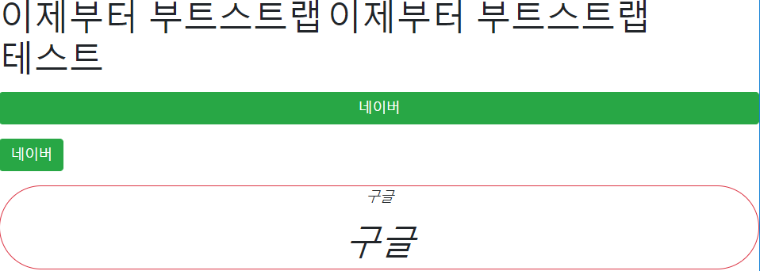

# Web 190731 Selector

## 셀렉터

```css
/* 모든 엘리먼트 */
* {
    color: red
}

/* 태그셀렉터 */
h1 {
    color: red;
}

/* 그룹 */
h1, h2 {
    background-color: gray;
}

/* 클래스 */
.class-selector {
    color: blue;
}

/* 아이디*/
#id-selecotr {
    color: green;
}
```

\* : 모든 엘리먼트에 적용할 효과 사용할 때

. : 클래스를 쓸 때

\# : 아이디를 쓸 때


 셀렉터들은 우선순위가 있다. 

` id > class > tag`


```CSS
h1 {
    color: red !important;
}
```

우선순위에 관계없이 강제로 주려할 떄

`!important` 를 사용하면 우선적으로 적용된다.


### 셀렉터의 기호들

```css
/* 자식 셀렉터 */
ul > li {
     color: pink;
}

 /* 바로뒤에 인접한 형제 */
 p + li {
     color: green;
 }

 /* 그 뒤로 쭉 형제 */
 p ~ li {
     color: blue;
 }

 /* 자손들 모두 */
 p li {
     color: blue;
 }

```

```html
    <ul>
        <li>position</li>
        <li>visibility</li>
        <li>display</li>
    </ul>

    <ol>
        <p>우리가 배운것</p>
        <li>position</li>
        <li>visibility</li>
        <li>display</li>
    </ol>
```

\> : 자식을 선택할 때 사용하는 기호	

\+ : p와 바로 인접한 + 뒤의 태그에 효과 적용

~ : p이후에 있는 li 모두에 태그를 적용

띄어쓰기 : p의 자손들 모두에게 효과를 적용


## BootStrap

CDN 활용을 통해 Bootstap에 작성된 CSS, JS를 활용하자!

 

m : margin

p : padding

t, b, l, r, x, y : top, bottom, .....  좌우, 위아래


| Extra small <576px  | Small ≥576px                         | Medium ≥768px | Large ≥992px | Extra large ≥1200px |            |
| ------------------- | ------------------------------------ | ------------- | ------------ | ------------------- | ---------- |
| Max container width | None (auto)                          | 540px         | 720px        | 960px               | 1140px     |
| Class prefix        | `.col-`                              | `.col-sm-`    | `.col-md-`   | `.col-lg-`          | `.col-xl-` |
| # of columns        | 12                                   |               |              |                     |            |
| Gutter width        | 30px (15px on each side of a column) |               |              |                     |            |
| Nestable            | Yes                                  |               |              |                     |            |
| Column ordering     | Yes                                  |               |              |                     |            |


##### Text

`text-align:center`  -> 중앙정렬 -> `class="text-center"`


항상 `div.container` 로 시작할것!

```html
<div class="container"></div>
```


```html
<!DOCTYPE html>
<html lang="en">
<head>
  <meta charset="UTF-8">
  <meta name="viewport" content="width=device-width, initial-scale=1.0">
  <meta http-equiv="X-UA-Compatible" content="ie=edge">
  <title>Document</title>
  <link rel="stylesheet" href="https://stackpath.bootstrapcdn.com/bootstrap/4.3.1/css/bootstrap.min.css" integrity="sha384-ggOyR0iXCbMQv3Xipma34MD+dH/1fQ784/j6cY/iJTQUOhcWr7x9JvoRxT2MZw1T" crossorigin="anonymous">
</head>
<body>
  <div class="continaer">
    <h1 class="mx-auto d-inline" style="width:50%">이제부터 부트스트랩</h1>
    <h1 class="mx-auto d-inline" style="width:50%">이제부터 부트스트랩</h1>
    <h1 class="d-lg-none">테스트</h1>
    <a href="https://www.naver.com" class="my-3 d-block btn btn-success">네이버</a>
    <a href="https://www.naver.com" class="btn btn-success">네이버</a>
    <div class="my-3 text-center border border-danger rounded-pill  ">
      <p class="font-italic">구글</p>
      <h1 class="font-italic">구글</h1>
    </div>
  </div>


  <script src="https://code.jquery.com/jquery-3.3.1.slim.min.js" integrity="sha384-q8i/X+965DzO0rT7abK41JStQIAqVgRVzpbzo5smXKp4YfRvH+8abtTE1Pi6jizo" crossorigin="anonymous"></script>
  <script src="https://cdnjs.cloudflare.com/ajax/libs/popper.js/1.14.7/umd/popper.min.js" integrity="sha384-UO2eT0CpHqdSJQ6hJty5KVphtPhzWj9WO1clHTMGa3JDZwrnQq4sF86dIHNDz0W1" crossorigin="anonymous"></script>
  <script src="https://stackpath.bootstrapcdn.com/bootstrap/4.3.1/js/bootstrap.min.js" integrity="sha384-JjSmVgyd0p3pXB1rRibZUAYoIIy6OrQ6VrjIEaFf/nJGzIxFDsf4x0xIM+B07jRM" crossorigin="anonymous"></script>
</body>
</html>
```

head의 마지막 링크 부분과 body의 마지막 script 3개를 부트스트랩 홈페이지에서 긁어와서 꼭 넣어야한다!




### Grid

```html
<div class="container">
    <div class="row">
        <div class="col-2 col-sm-6 col-md-2 col-lg-6 col-xl-2 bg-danger">
            여기는 여섯칸
        </div>
    </div>
    <div class="row">
        <div class="col-6 bg-info">
            여기는 여섯칸
        </div>
    </div>
</div>
```

그리드는 기본적으로 row안에 들어가는 항목들이 12개를 기준으로 col-? 주는 만큼 비율을 줄 수 있다.


## Flask

```python
from flask import Flask, escape, request, render_template
import random

app = Flask(__name__)

@app.route('/')
def hello():
    return render_template('index.html')

@app.route('/lotto')
def lotto():
    numbers = random.sample(range(1,46), 6)
    print(numbers.sort())
    return render_template('lotto.html', numbers=numbers)


# python app.py
if __name__ == "__main__":
    app.run(debug=True)
```


```html
<!DOCTYPE html>
<html lang="en">
<head>
  <meta charset="UTF-8">
  <meta name="viewport" content="width=device-width, initial-scale=1.0">
  <meta http-equiv="X-UA-Compatible" content="ie=edge">
  <title>Document</title>
  <link rel="stylesheet" href="https://stackpath.bootstrapcdn.com/bootstrap/4.3.1/css/bootstrap.min.css" integrity="sha384-ggOyR0iXCbMQv3Xipma34MD+dH/1fQ784/j6cY/iJTQUOhcWr7x9JvoRxT2MZw1T" crossorigin="anonymous">
</head>
<body>
  <!-- 네브바 -->
  <nav class="navbar navbar-expand-lg navbar-light bg-light">
    <a class="navbar-brand" href="/">MySite</a>
    <button class="navbar-toggler" type="button" data-toggle="collapse" data-target="#navbarNavAltMarkup" aria-controls="navbarNavAltMarkup" aria-expanded="false" aria-label="Toggle navigation">
      <span class="navbar-toggler-icon"></span>
    </button>
    <div class="collapse navbar-collapse" id="navbarNavAltMarkup">
      <div class="navbar-nav">
        <a class="nav-item nav-link active" href="/lotto">Lotto <span class="sr-only">(current)</span></a>
        <a class="nav-item nav-link" href="#">Lunch</a>
        <a class="nav-item nav-link" href="#">opgg</a>
        <a class="nav-item nav-link disabled" href="#" tabindex="-1" aria-disabled="true">Disabled</a>
      </div>
    </div>
  </nav>

  <div class="container">
    
    
  </div>

  <script src="https://code.jquery.com/jquery-3.3.1.slim.min.js" integrity="sha384-q8i/X+965DzO0rT7abK41JStQIAqVgRVzpbzo5smXKp4YfRvH+8abtTE1Pi6jizo" crossorigin="anonymous"></script>
  <script src="https://cdnjs.cloudflare.com/ajax/libs/popper.js/1.14.7/umd/popper.min.js" integrity="sha384-UO2eT0CpHqdSJQ6hJty5KVphtPhzWj9WO1clHTMGa3JDZwrnQq4sF86dIHNDz0W1" crossorigin="anonymous"></script>
  <script src="https://stackpath.bootstrapcdn.com/bootstrap/4.3.1/js/bootstrap.min.js" integrity="sha384-JjSmVgyd0p3pXB1rRibZUAYoIIy6OrQ6VrjIEaFf/nJGzIxFDsf4x0xIM+B07jRM" crossorigin="anonymous"></script>
</body>
</html>
```


```html



  <h1>여기는 저의 사이트입니다.</h1>

```

이 방식 중요!

extends를 통해서 공통되는 부분들을 하나로 묶어서 사용!

첫번째 항목의 

```html


```
을 사용하고

안에 넣는 것들을 다른 html 에서

```html

  <h1>여기는 저의 사이트입니다.</h1>

```

로 사용한다.!!