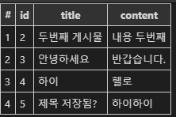

# Web 190806 Django_Advanced

#### GET

기본적으로는 get

url 뒤에 붙는 정보를 가져온다.

```python
def pong(request):
    user_input = request.GET.get('name')
    user_age = request.GET.get('age')
    context = {
        'user_input': user_input,
        'user_age': user_age,
    }
    return render(request, 'pong.html', context)
```


#### POST

url 뒤에 정보가 보이지 않는다.

```python
def post_pong(request):
    username = request.POST.get('username')
    password = request.POST.get('password')
    context = {
        'username': username,
        'password': password,
    }
    return render(request, 'post_pong.html', context)
```

post_pong.html

```html


  <h1>포스트핑입니다.</h1>
  <form action="/post-pong/" method="post">
    
    <input type="text" name="username">
    <input type="text" name="password">
    <input type="submit" value="login">
  </form>

```

csrf_token이 들어가야 작동한다!

csrf :   CSRF 공격(Cross Site Request Forgery)은 웹 어플리케이션 취약점 중 하나로 인터넷 사용자(희생자)가 자신의 의지와는 무관하게 공격자가 의도한 행위(수정, 삭제, 등록 등)를 특정 웹사이트에 요청하게 만드는 공격입니다.

출처: https://itstory.tk/entry/CSRF-공격이란-그리고-CSRF-방어-방법 [덕's IT Story]  


#### static

```html




  <link rel="stylesheet" href="">
  <h1>해리포터와 돌멩이</h1>
  
  

```

static 을 활용하려면 `` 을 써줘야한다.

 안에 static으로 시작하고 안의 파일 경로를 써주면 이미지나 링크가 적용된다.

페이지에 이미지가 남아있는경우 Ctrl+Shift+R 로 캐싱된 이미지를 없애고 완전한 새로고침을 할 수 있다.


여러개의 앱이 중복되는 views를 가질때!

```python
from django.contrib import admin
from django.urls import path, include
from pages import views

urlpatterns = [
    path('admin/', admin.site.urls),
    path('pages/', include('pages.urls')),
    path('utilities/', include('utilities.urls')),
]
```

위와 같이 각각의 pages와 utilities 에 url을 만들어서 각각의 path를 옮긴다.

include는 django.urls 에서 import 해줘야한다.


### 데이터베이스

스키마(scheme) : 제목, 내용, 글쓴이 등 항목들의 속성정보

f1 - > SQlite:Database -> 왼쪽아래 SQLITE EXPLORER 생김




##### 생성

post1 = Post(title="하이", content="헬로")

post1.save()


#####  읽기

Post.objects.get(id=1)

<Post: Post object (1)>


##### 여러개 읽기

Post.objects.filter(title="안녕하세요")

<QuerySet [<Post: Post object (1)>, <Post: Post object (3)>]>


##### 데이터 수정

p.title="hello"

p.save() ->해야지 바뀜


##### 데이터 삭제

p.delete()

(1, {'posts.Post': 1})


```html





```

연결되는 구조 잊지말 것!