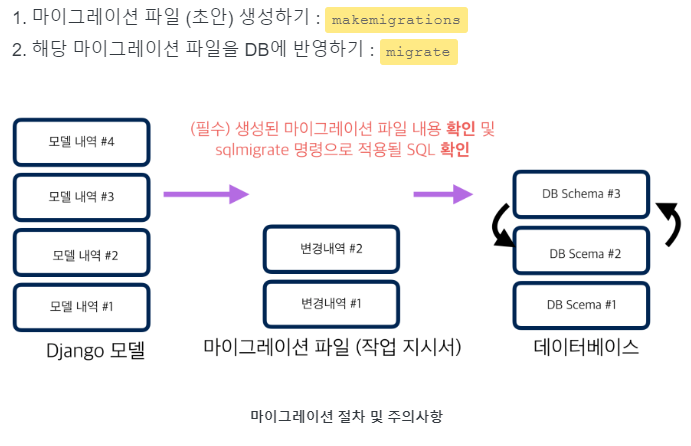
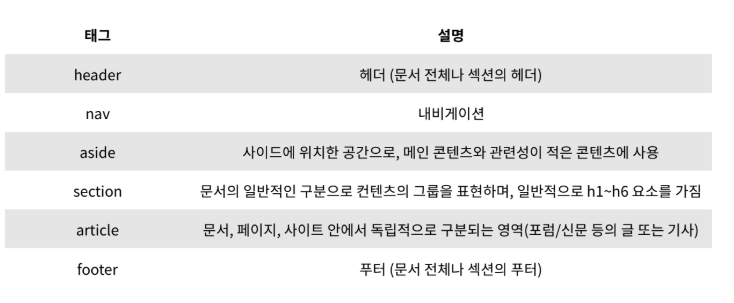
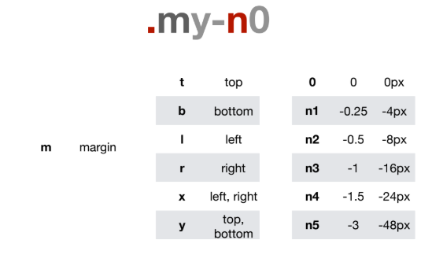

# Web 190808  Django Comment

### review

models 

`python manage.py makemigrations` : 번역!

`python manage.py migrate` : 번역!

`python manage.py createsuperuser`

Django에서 사용 가능한 모듈 및 메서드를 대화식 Python Shell에서 사용하려고 할 때

`python manage.py shell`

#### Today

models.py

`created_at = models.DateTimeField(auto_now_add=True)` 

현재날짜시간을 자동으로 작성!

### Test Review

시맨틱 태그!

의미는 없지만 공간을 나누기 위해 쓰는 태그들

부츠 스트랩 음수

### form tag

input등

label의 `for` 와 input의 `id` 가 같아야 연결됨

value 는 기본값

### a tag

연결 시켜주는 태그 `href` 안에 원하는 것을 연결시켜주는 것.

### h tag

`target : _black` 새창

`tartget : _self` 현재창 (default)