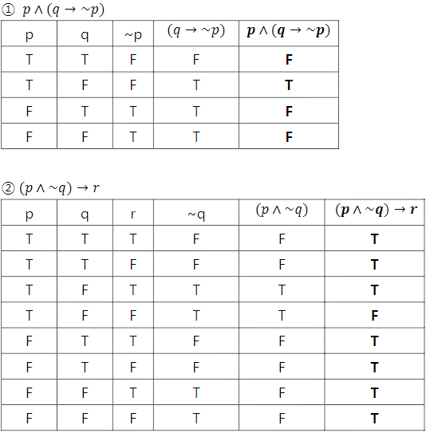
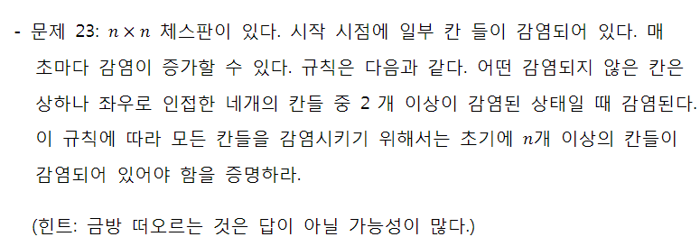

# Computational_Thinking

### 대우조건

| p q  | p -> q | ~q  ~p | ~q -> ~p |
| ---- | ------ | ------ | -------- |
| T T  | T      | F F    | T        |
| T F  | F      | T F    | F        |
| F T  | T      | F T    | T        |
| F F  | T      | T T    | T        |

~ : 반대되는 reverse

v : 논리 합 (OR) 

^ : 논리 곱 (AND)

-> : 전제 ~ 라면

p -> q : 기본

q - > p : 역(converse)

~p -> ~q : 이(inverse)

~q -> ~p : 대우(contraposition)

 

Trivial Proof: ∀x,P(x)→Q(x)를증명하려는데, Q(x)가항상참인경우

​	전제의 뒷부분이 참이면 항상 참이 된다.

Vacuous Proof: ∀x,P(x)→Q(x)를증명하려는데, P(x)가항상거짓인경우

​	전제의 앞이 거짓이면 항상 참이 된다.

.jpg)

.jpg)

.jpg)

.jpg).jpg)

.jpg)

.jpg)

.jpg)

.jpg)

.jpg)

.jpg

.jpg)

.jpg)

.jpg)

.jpg)

.jpg)

모든 칸이 감염되기 위해서는 대각선이 모두 감염되어야 한다.

1칸이 감염되어있으면 1칸만 감염

2x2면 대각선 2개가 감염 되어있으면 2^2 감염

3x3 면 대각선 3개가 감염 되어있으면 3^2 감염

